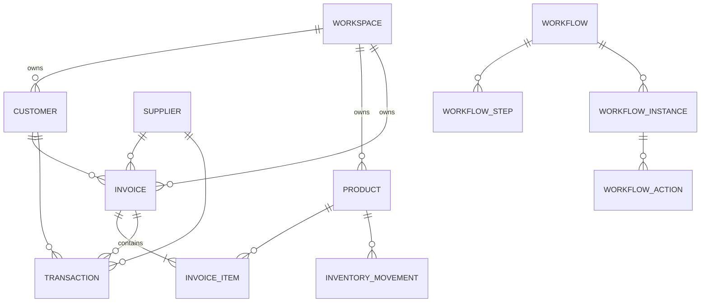

# Hisabche — Domain Model

> The **what** of the product: entities, relations, invariants, rules.
> Read this before any feature work. Companion docs: DATABASE_SCHEMA.md
> (tables), USER_FLOWS.md (process), OFFLINE_SYNC.md (distribution).

## 1. Core Entities

| Entity                                                                                 | Key fields                                                                                                                                                        | Owned by                        | Notes                                |
| -------------------------------------------------------------------------------------- | ----------------------------------------------------------------------------------------------------------------------------------------------------------------- | ------------------------------- | ------------------------------------ |
| **Workspace**                                                                          | id, name, slug (unique)                                                                                                                                           | — (tenant root)                 | Multi-tenancy boundary               |
| **User**                                                                               | id (auth), email, profile                                                                                                                                         | Supabase auth                   | Members via membership               |
| **Customer**                                                                           | full_name, phone, email, address, opening_balance                                                                                                                 | workspace                       | Debt source                          |
| **Supplier**                                                                           | (no table) via `invoices.supplier_id`                                                                                                                             | workspace                       | Purchase counterpart                 |
| **Product**                                                                            | name, sku, barcode, category, quantity, unit, buy/sell/wholesale_price, min_stock_level                                                                           | workspace                       |                                      |
| **Warehouse**                                                                          | name, address (backend route)                                                                                                                                     | workspace                       | Stock locations                      |
| **Invoice**                                                                            | invoice_number, type(sale/purchase), customer/supplier, date, due_date, subtotal, discount_total, tax_total, total, paid_amount, currency, payment_method, status | workspace                       |                                      |
| **InvoiceItem**                                                                        | invoice_id, product_id?, product_name, quantity, unit_price, discount, total_price                                                                                | invoice                         | Denormalized name snapshot           |
| **Transaction**                                                                        | customer/supplier, type(sale/purchase/payment/receipt/return), amount, currency, date                                                                             | workspace                       | Payment/movement ledger              |
| **InventoryMovement**                                                                  | product_id, type, quantity, reference, date                                                                                                                       | (desktop/offline; server table) | Every stock change                   |
| **ExchangeRate**                                                                       | currency_code, rate, updated_at                                                                                                                                   | global                          | Relative to AFN base                 |
| **Workflow**                                                                           | workspace, name, entity_type, is_active                                                                                                                           | workspace                       | Approval template                    |
| **WorkflowStep**                                                                       | workflow, step_order, approver_role/user, is_final                                                                                                                | workflow                        | Ordered approval                     |
| **WorkflowInstance**                                                                   | workflow, entity_type, entity_id, status, current_step                                                                                                            | workspace                       | Live approval                        |
| **WorkflowAction**                                                                     | instance, step, action, actor, role, comment                                                                                                                      | instance                        | Approval decision                    |
| **Employee / Payroll / Attendance / Project / Task / BOM / WorkOrder / PurchaseOrder** | —                                                                                                                                                                 | workspace                       | Operational modules (backend-backed) |

## 2. Relations (core graph)

```
Customer 1───* Invoice      (sale; invoices.customer_id)
Supplier 1───* Invoice      (purchase; invoices.supplier_id)
Invoice  1───* InvoiceItem  (invoice_items.invoice_id)
Product  1───* InvoiceItem  (invoice_items.product_id)
Invoice  1───* Transaction  (payments/receipts against invoice)
Product  1───* InventoryMovement
Workflow 1───* WorkflowStep
Workflow 1───* WorkflowInstance
WorkflowInstance 1───* WorkflowAction
WorkflowInstance *───1 Entity  (any: invoice, purchase…)
User *───* Workspace        (membership role: owner/admin/member/viewer)
```

### Mermaid



## 3. Invariants (business rules)

### Tenant

- Every business entity requires a **workspace** — an invoice cannot exist
  without a workspace.

### Product / Inventory

- Stock `quantity` is a running balance; every change is an `inventory_movement`.
- `min_stock_level` (default 5) triggers low-stock alerts.
- Products may be `is_active=false` to hide, not delete from history.

### Invoice

- Must have ≥1 item (`items min 1`).
- `total = subtotal − discount_total + tax_total`, computed server-side.
- Item `total_price = unit_price × quantity − discount`.
- `type ∈ {sale, purchase}`; sale → customer, purchase → supplier.
- Item `product_id` optional — free-typed line (service, no product).
- Item stores `product_name` snapshot so history survives product renames.

### Currency

- Supported codes: **`AFN`, `USD`, `PKR`, `IRR`**
  (`packages/store/src/slices/currency.slice.ts`).
- Base/reporting currency **AFN**; `exchangeRates` relative to AFN.
- Amounts: decimal (`numeric(12,2)`), never float math.
- Default on new records: `currency = "AFN"`.

### Payment & Debt

- **Debt is derived, never stored** — `debt = total − paid_amount`
  (accumulated across `transactions`).
- `transactions.type` ∈ `{sale, purchase, payment, receipt, return}`:
  - `payment` reduces debt (customer pays).
  - `receipt` reduces payable (you pay supplier).
- Invoice status transitions: `pending → paid | completed | partial |
cancelled | overdue` (validated by `invoiceStatusSchema`).

### Permission

- Capability gates (see AUTH_AND_PERMISSION.md): `record.delete` requires
  `owner`; `member.invite` requires `admin+`.

### Approval (when configured)

- An invoice/purchase can start a `workflow_instance`.
- Instance advances only via matching `workflow_action` whose
  `actor_role` equals the step's `approver_role` (403 otherwise).
- Final step approval canonically completes the entity.

### Currency (validation detail)

- Business may set `primaryCurrency` / `secondaryCurrency`; conversion uses
  `rates` (AFN base). Offline default rates baked in slice.

## 4. Domain notes / gaps

- **Supplier** is a first-class _domain_ concept but has **no dedicated
  table** — it's the `supplier_id` on invoices/transactions. If supplier
  management grows, a `suppliers` table + relation must be added.
- `Warehouse`, `PurchaseOrder`, `BOM`, `WorkOrder`, `Project/Task`, HR all
  exist as backend routes with their own (partly Supabase-managed) storage;
  only the core ledger tables are in Drizzle migrations.
- `invoices.deleted` flag: not in schema — delete is hard delete.
- Multi-workspace isolation is the load-bearing domain rule: **any code**
  querying business rows must filter by the session's `workspace_id`.
