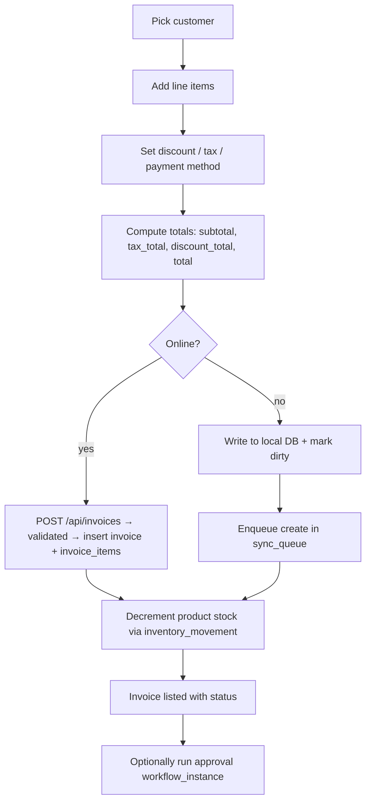
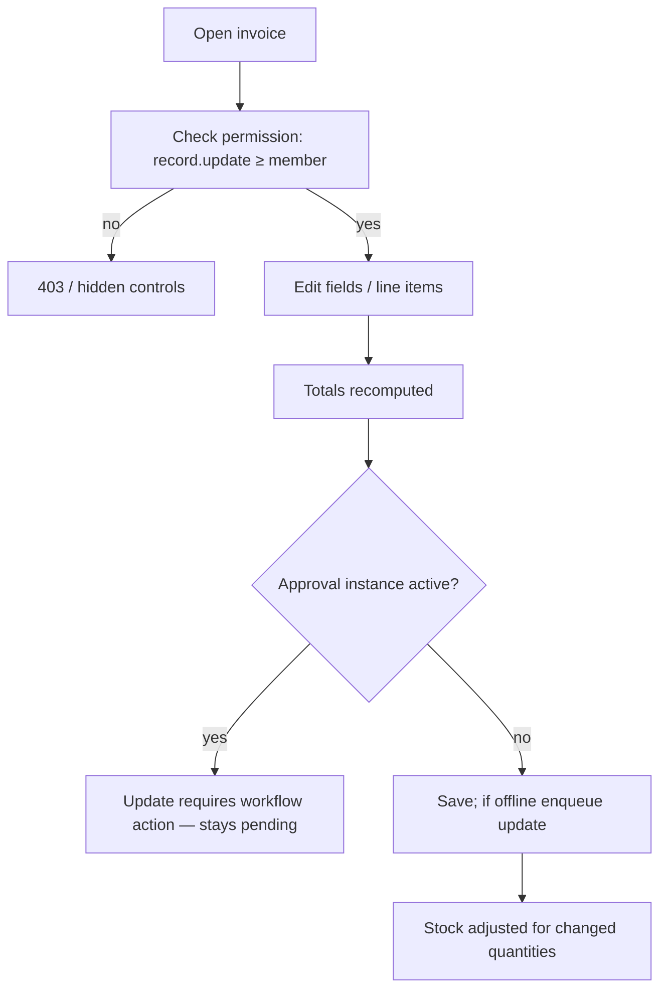
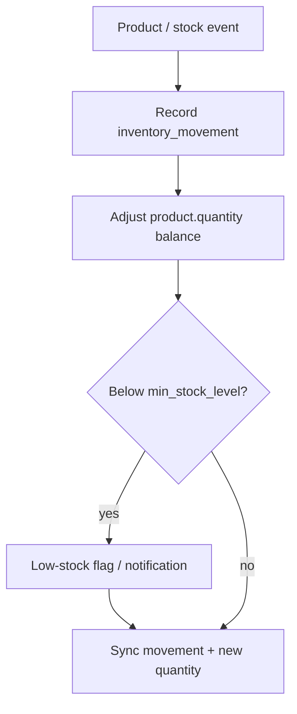
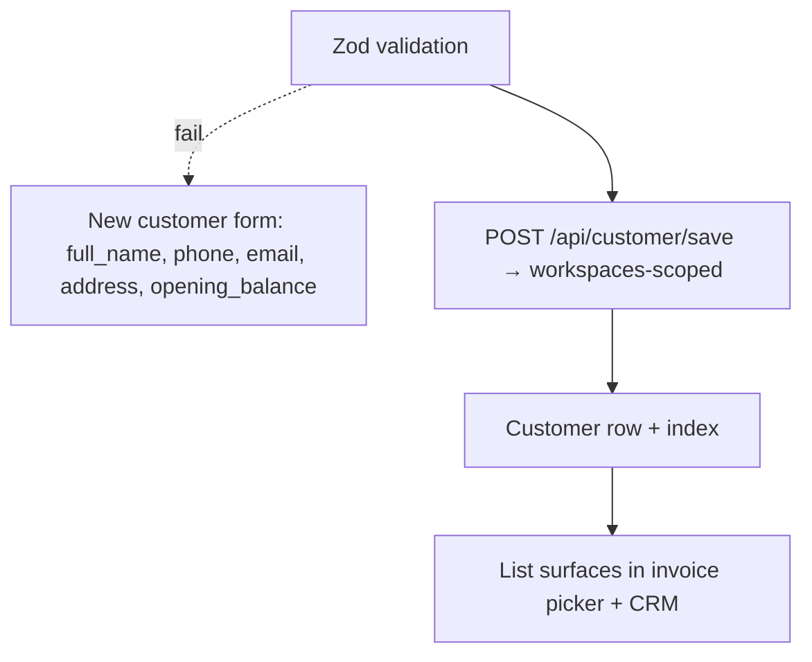
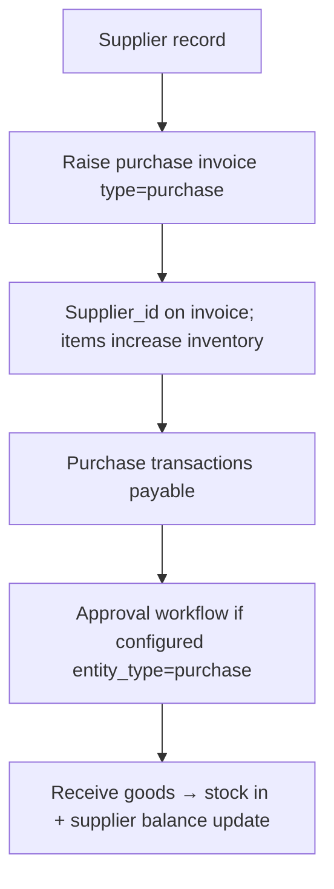
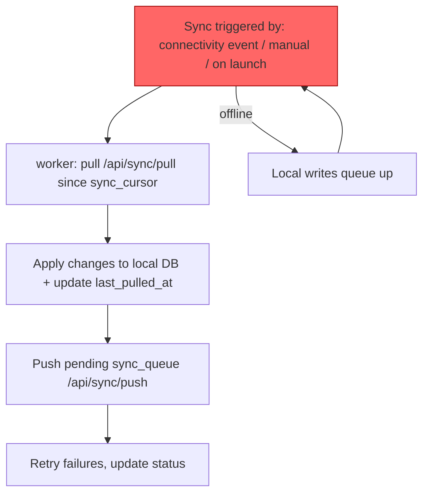

# Hisabche — User Flows

## Authentication Flow

### Web

```mermaid
flowchart TD
  A[User opens /[lang]/login] --> B[Enters email + password]
  B --> C[POST /api/auth/login — Zod validated]
  C --> D[Supabase Auth verifies credentials]
  D -- ok --> E[Backend returns session: token + user profile]
  E --> F[Session written to localStorage via auth-core adapter]
  F --> G[Redirect to /[lang]/dashboard]
  D -- fail --> H[401 / error message shown]
  C -- validation fail --> I[Client shows field errors]
```

### Desktop (Electron)

```mermaid
flowchart TD
  A[Renderer login form] --> B[IPC: secure:set (token)]
  B --> C[Main process writes to OS credential store]
  C --> D[Keychain / Credential Manager / encrypted file]
  D --> E[Auth store hydrated from sessionStore]
  E --> F[registerTokenGetter with API client]
  F --> G[Validate session / refresh token]
  G --> H[Open dashboard window]
```

### Mobile

```mermaid
flowchart TD
  A[App launch] --> B[Read session from expo-secure-store]
  B --> C{Valid session?}
  C -- yes --> D[Restore session state]
  D --> E[performSync — push local queue, pull changes]
  E --> F[(tabs) dashboard]
  C -- no --> G[(auth) login screen]
```

## Business Flows

### Create Invoice (sale)



### Edit Invoice



### Inventory Update



### Customer Creation



### Supplier Workflow



### Permission Checking

```mermaid
flowchart TD
  A[User action] --> B[Map action to capability]
  B --> C[{owner, admin, member, viewer} rank]
  C --> D[roleAtLeast(capability) ?]
  D -- ok --> E[Proceed]
  D -- no --> F[403 / hidden UI]
  F --> G[Audit event logged]
```

Capability table (from `@hisabche/auth-core`):

| Capability       | Minimum role |
| ---------------- | ------------ |
| record.read      | viewer       |
| record.create    | member       |
| record.update    | member       |
| record.delete    | owner        |
| member.invite    | admin        |
| workspace.manage | owner        |

### Data Synchronization



Web also exposes realtime sync (Supabase Realtime hooks) so multiple
clients see each other's changes; `sync-center` shows queue/status UI.
